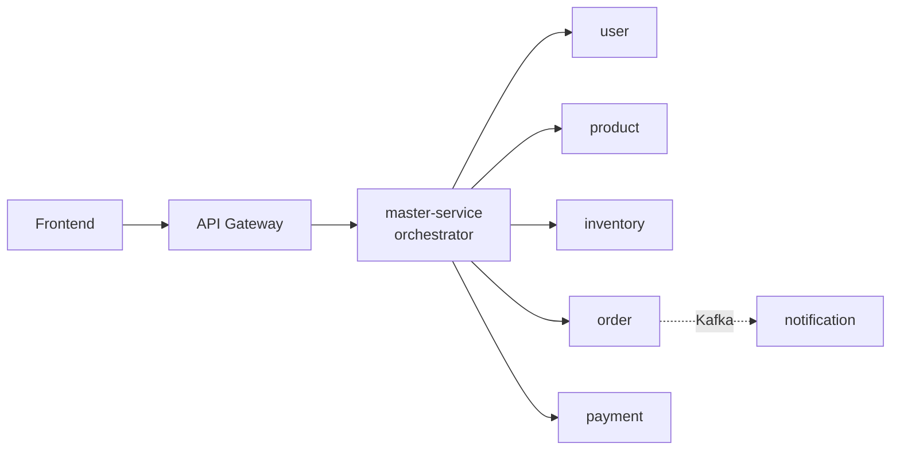

# Microservices Platform

A production-style reference implementation of an **orchestrated microservices** system: Java 21,
Spring Boot 3.5, and later React, PostgreSQL, Redis, Kafka, OAuth2, OpenTelemetry, Docker and Kubernetes.
It's built **phase by phase** so each architectural concept is introduced, explained and tested on its own.



## Roadmap

| Phase | Topic | Status |
|---|---|---|
| 1 | Basic Spring Boot microservices | ✅ **done** |
| 2 | Master/orchestrator communication + API gateway | ⏳ next |
| 3 | PostgreSQL (database-per-service) + Flyway | |
| 4 | Frontend (React + TypeScript) | |
| 5 | Docker Compose | |
| 6 | Redis | |
| 7 | Kafka, saga, outbox, asynchronous workflows | |
| 8 | Resilience (Resilience4j) | |
| 9 | OAuth2/OIDC + JWT | |
| 10 | Observability (OpenTelemetry, Prometheus, Grafana) | |
| 11 | Testcontainers, contract and end-to-end tests | |
| 12 | CI/CD (GitHub Actions) | |
| 13 | Kubernetes / Helm | |
| 14 | Production hardening | |

Each phase is documented in [`docs/phases/`](docs/phases). Start with
[Phase 1](docs/phases/phase-01-foundations.md).

## Documentation

* [Architecture overview](docs/architecture/overview.md): responsibilities, communication styles, data ownership
* [API guidelines](docs/architecture/api-guidelines.md): versioning, status codes, error contract, paging, idempotency, correlation IDs
* [Service catalog](docs/architecture/services.md): every endpoint, port and Swagger URL

## Prerequisites

| Tool | Version | Needed from |
|---|---|---|
| JDK | 21+ | Phase 1 |
| Maven | not required, use the bundled `./mvnw` | Phase 1 |
| Docker + Compose v2 | 24+ | Phase 5 |
| Node.js | 20+ | Phase 4 |

## Quick start

```bash
git clone <this repo> && cd java-react
cp .env.example .env          # optional in Phase 1: no secrets needed yet
./mvnw clean install          # builds everything and runs all tests
```

## Running services

Each service is a standalone Spring Boot app with its own port:

| Service | Port | Command |
|---|---|---|
| master-service | 8081 | `./mvnw -pl services/master-service spring-boot:run` |
| user-service | 8082 | `./mvnw -pl services/user-service spring-boot:run` |
| product-service | 8083 | `./mvnw -pl services/product-service spring-boot:run` |
| inventory-service | 8084 | `./mvnw -pl services/inventory-service spring-boot:run` |
| order-service | 8085 | `./mvnw -pl services/order-service spring-boot:run` |
| payment-service | 8086 | `./mvnw -pl services/payment-service spring-boot:run` |
| notification-service | 8087 | `./mvnw -pl services/notification-service spring-boot:run` |

You can also run the packaged jar: `java -jar services/<name>/target/<name>-0.1.0-SNAPSHOT.jar`.

* Change a port: `SERVER_PORT=9082 ./mvnw -pl services/user-service spring-boot:run`
* Choose a profile: `SPRING_PROFILES_ACTIVE=prod java -jar ...`. The default is `dev`.

"Run everything with Docker" (`docker compose up --build`) arrives in Phase 5.

## Running tests

```bash
./mvnw test                                          # all modules
./mvnw -pl services/payment-service -am test         # one service
./mvnw -pl services/payment-service -am test -Dtest=PaymentServiceTest
```

## Swagger / OpenAPI

With a service running, open `http://localhost:<port>/swagger-ui.html`. The raw spec is at `/v3/api-docs`.
Swagger is disabled in the `prod` profile.

## Health checks

```bash
curl localhost:8082/actuator/health/liveness    # is the process alive? (restart if not)
curl localhost:8082/actuator/health/readiness   # can it take traffic? (remove from load balancer if not)
```

## Logs and correlation IDs

Every request gets an `X-Correlation-Id`. It's generated if you don't send one, echoed on the response, included
in error bodies, and printed on every log line:

```
INFO ... [payment-service] [tomcat-handler-3] [690e11fb-...] c.p.payment.service.PaymentService : Payment ... COMPLETED
```

The `prod` profile writes structured JSON (ECS) instead, with `correlationId` as a field:

```bash
SPRING_PROFILES_ACTIVE=prod java -jar services/payment-service/target/payment-service-0.1.0-SNAPSHOT.jar
```

To follow one request, send your own ID and search the logs for it:

```bash
curl -H 'X-Correlation-Id: my-debug-0001' localhost:8082/api/v1/users/...
grep my-debug-0001 <service log>
```

## Debugging a service

```bash
./mvnw -pl services/order-service spring-boot:run \
  -Dspring-boot.run.jvmArguments="-agentlib:jdwp=transport=dt_socket,server=y,suspend=n,address=*:5005"
```

Then attach your IDE's remote debugger to port 5005. Or run the `*ServiceApplication` main class directly from the IDE.

## Coming in later phases

Kafka inspection, database access, Grafana, Kubernetes deployment and the production deployment guide are
added to this README in the phases that introduce them.

## Repository layout

```
libs/common-web/        shared cross-cutting web plumbing (no domain code)
services/<name>/        one deployable Spring Boot service each
docs/                   architecture, API guidelines, per-phase guides
```

Later phases add `frontend/`, `api-gateway/`, `infrastructure/`, `deployment/` and `.github/workflows/`.
