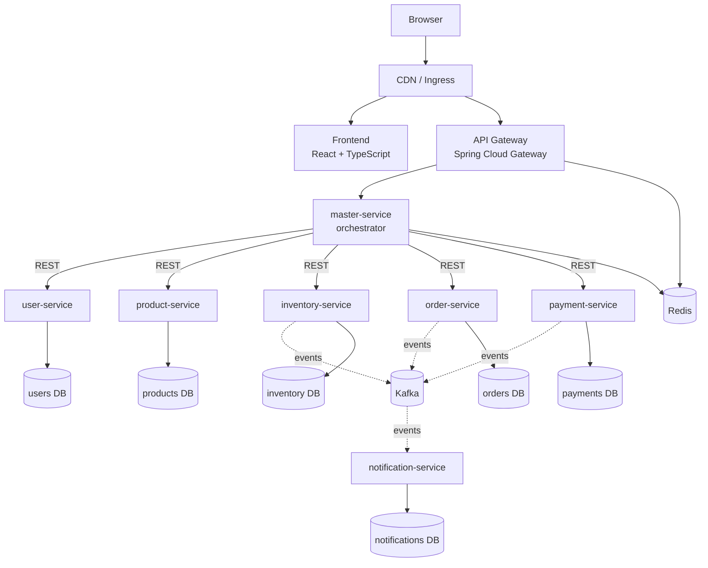
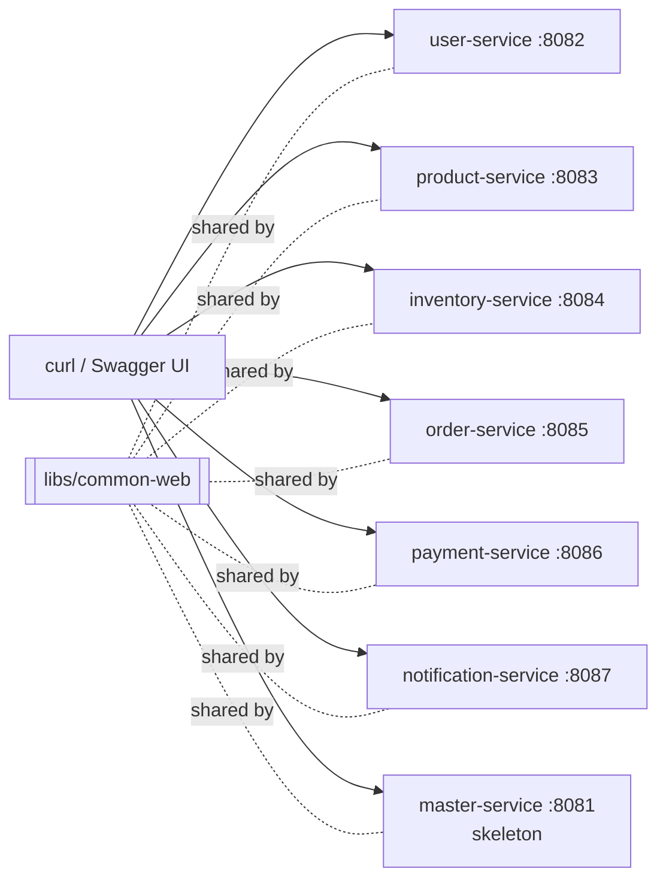

# Architecture Overview

## Target architecture (end of Phase 14)

Everything to the right of the gateway is on a private network. Only the ingress is public.

## Phase 1: what exists today

Seven independently runnable Spring Boot services, each with its own in-memory store. Nothing calls
anything else yet. Phase 2 adds the gateway and orchestration, and Phase 3 replaces the in-memory stores with
one PostgreSQL database per service.

## Service responsibilities

| Service | Owns | Does NOT own |
|---|---|---|
| **master-service** | Workflow coordination, response aggregation, partial-failure handling, idempotency at the edge, correlation/trace propagation | Any database. Any domain rule (pricing, stock, order state, …) |
| **user-service** | User accounts, profiles, "may this customer order?" | Orders, addresses for shipping (future) |
| **product-service** | Catalog, active/inactive availability, authoritative pricing & price quotes | Stock levels |
| **inventory-service** | Stock levels, all-or-nothing reservations, release (compensation), commit | Prices, orders |
| **order-service** | Order creation, order state machine, status history, order history | Payment processing, stock |
| **payment-service** | Idempotent payment initiation, payment status, provider integration | Card data (never stored or logged) |
| **notification-service** | Templated email/SMS/push delivery, delivery status (Kafka consumers, retry and DLQ in Phase 7) | Deciding *when* to notify |

### Why is the master-service not a monolith?

The master-service answers "**which** services, in **what order**, and **what if one fails**?". It never answers
"is there enough stock?" or "what does P100 cost?". Those questions go to the owning service. A useful test is
that deleting any domain service should leave the master-service with no leftover business rules for that domain.

`libs/common-web` has the same limit. It holds only cross-cutting web plumbing (error contract,
correlation IDs, paging envelope, OpenAPI defaults) and no domain types, so services don't couple through a
shared model.

## Communication styles (introduced in Phases 2 and 7)

| Style | Used for | Why |
|---|---|---|
| Synchronous REST | Master → user / product / inventory / order / payment while placing an order | The browser is waiting and needs an immediate answer: is the customer valid, what is the price, is there stock, did payment succeed? |
| Asynchronous Kafka events | order/payment/inventory → notification; saga steps | Nobody is waiting. The consumer can be slow or down without failing the order, and new consumers can subscribe without changing producers. |

## Data ownership: why cross-service joins are prohibited

Each service is the **only** reader and writer of its data (database-per-service from Phase 3). A service that
joined another service's tables would:

1. **Couple deployments**: a column rename in `orders` would break `payment-service` at runtime, so the two
   could no longer ship independently.
2. **Bypass invariants**: inventory's "never negative stock" rule is enforced in code. A direct SQL writer skips it.
3. **Prevent independent scaling and technology choices**: each database can be sized, tuned, or replaced separately.
4. **Hide dependencies**: API/event calls are visible, versioned, and traced. A cross-database query is invisible.

Data another service needs is obtained through its **API** (synchronous) or by consuming its **events** and
keeping a local read-model (asynchronous). Order lines, for example, *copy* the product name and price at purchase
time instead of joining the catalog.
