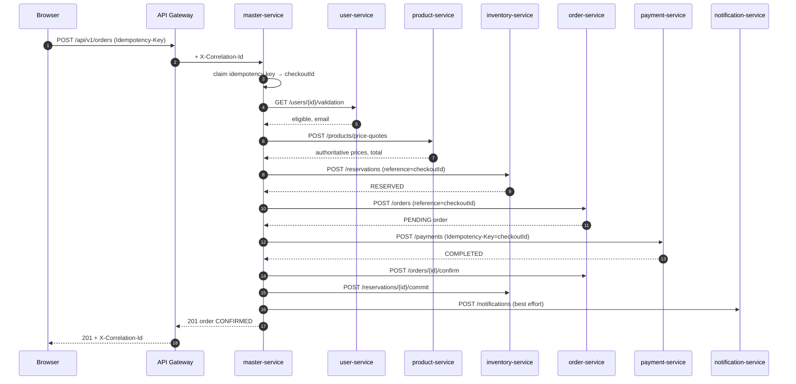
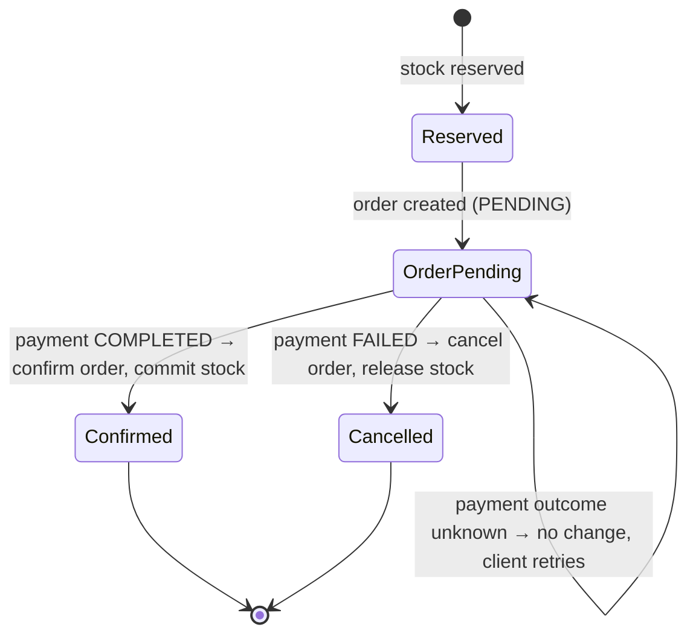

# Phase 2: API Gateway and Master/Orchestrator Communication

## Goal

Make the services work together. The browser gets one public entry point (the **API Gateway**), and multi-service
workflows move into the **master-service**, which orchestrates synchronous REST calls, aggregates responses and
handles partial failures. The domain services keep their own rules.

## Architecture after Phase 2

```mermaid
flowchart LR
    client[Browser / curl] -->|:8080 only public port| gw[api-gateway]
    gw -->|/api/v1/orders*| master[master-service :8081]
    gw -->|GET /api/v1/products*| product[product-service :8083]
    gw -->|POST /api/v1/users, GET /api/v1/users/id| user[user-service :8082]
    master --> user & product
    master --> inventory[inventory-service :8084]
    master --> order[order-service :8085]
    master --> payment[payment-service :8086]
    master --> notification[notification-service :8087]
```



**Routing rule:** a request that needs one service goes straight to that service. A request that needs several
services, or a decision about failures, goes to the master-service. Everything not on the gateway's allow-list returns
404, so inventory, payments, notifications and order state commands can't be reached from outside.

| Public route (gateway) | Target | Why there |
|---|---|---|
| `POST /api/v1/orders` | master-service | Checkout touches 5 services and needs compensation |
| `GET /api/v1/orders/{id}` | master-service | Aggregates order and payment data |
| `GET /api/v1/orders?customerId=` | master-service | Public order-history contract (scoped to the caller in Phase 9) |
| `GET /api/v1/products[/{id}]` | product-service | Simple read, so no orchestration needed |
| `POST /api/v1/users`, `GET /api/v1/users/{id}` | user-service | Simple sign-up and profile read |

## Checkout sequence (synchronous workflow)



### Why synchronous here, and why asynchronous later

The browser is **waiting** on checkout: it has to know right away whether the customer is valid, what the price is,
whether stock exists and whether payment succeeded. Those steps are synchronous REST calls. The confirmation email
is also a REST call in Phase 2, but it's treated as **best-effort**: a failure only adds a `NOTIFICATION_NOT_SENT`
warning. In Phase 7 it becomes an `order.confirmed` Kafka event (Order → Kafka → Notification), because nobody is
waiting for the email and the email service should be allowed to be slow or down.

## Failure handling

The central rule is to **compensate only after a definitive failure**. When the outcome is unknown, leave the state
alone and let the client retry with the same Idempotency-Key.

| Step fails | Kind | What the master does | Client sees |
|---|---|---|---|
| User not found / suspended | definitive | nothing to undo | 422 `CUSTOMER_NOT_FOUND` / `CUSTOMER_NOT_ELIGIBLE` |
| Product unavailable | definitive | nothing to undo | 422 `PRODUCT_UNAVAILABLE` (passed through) |
| Stock insufficient | definitive | nothing to undo (all-or-nothing reservation) | 422 `INSUFFICIENT_STOCK` (passed through) |
| Order rejected (4xx) | definitive | release reservation | 502 `DOWNSTREAM_REJECTED` |
| Order-service timeout | **unknown** (order may exist) | nothing; retry resumes | 503 `DOWNSTREAM_UNAVAILABLE` |
| Payment **declined** | definitive | cancel order, release stock, email `PAYMENT_FAILED` | 402 `PAYMENT_DECLINED` |
| Payment timeout / 5xx / 409 | **unknown** (may be charged) | **nothing**, and never re-sends the charge | 503 `PAYMENT_OUTCOME_UNKNOWN` |
| Confirm / commit / email after payment | payment already taken | keep going, record a warning | 201 with `warnings` |
| Any service unreachable before payment | transient | nothing to undo | 503 `DOWNSTREAM_UNAVAILABLE` |

Compensation calls are best-effort in Phase 2. If one fails it's logged as `COMPENSATION FAILED` for
reconciliation. Phase 7 makes compensation reliable with an event-driven saga and the outbox pattern, which also
covers the master-service crashing mid-checkout.

### Payment state transitions



## Idempotency: why retries are safe

1. The client sends `Idempotency-Key` (one per checkout attempt, reused on retry).
2. The master derives `checkoutId = UUIDv3(customerId + key)`. It's deterministic and scoped per customer, so two
   customers can't collide.
3. **Every** downstream mutation is keyed on `checkoutId`: the reservation `reference`, the order `reference` and the
   payment `Idempotency-Key`. A retried checkout re-runs the steps, and each service returns what it already did
   instead of doing it again. **A customer can never be charged twice.**
4. The master remembers finished outcomes. A successful checkout replays as `200` + `Idempotent-Replayed: true`, and a
   4xx replays the same error. 5xx outcomes are forgotten so the retry can resume. The same key with a different
   basket returns `422 IDEMPOTENCY_KEY_REUSED`. A concurrent duplicate returns `409 CHECKOUT_IN_PROGRESS`.

The store is in memory in Phase 2 (single instance). Phase 6 moves it to Redis so it's shared by all replicas.

## Timeouts

| Hop | Connect | Read | Reason |
|---|---|---|---|
| Gateway → any service | 1 s | 5 s | fail fast by default |
| Gateway → master (`/orders`) | 1 s | 15 s | checkout may wait for the payment provider |
| Master → user / product / notification | 1 s | 2 s | simple lookups |
| Master → inventory / order | 1 s | 3 s | small writes |
| Master → payment | 1 s | 10 s | providers are slow. Timing out early only creates more "unknown" outcomes |

Each outer timeout is longer than the sum of the inner ones it waits for, so the innermost failure is the one that
gets reported. **Retries are deliberately absent in Phase 2.** Phase 8 adds Resilience4j retry with backoff for
idempotent reads, circuit breakers, bulkheads and rate limits. It also refines "connection refused" (the request
provably never reached the service) from *unknown* to *definitive*.

## Correlation IDs across services

The gateway creates `X-Correlation-Id` (or keeps a valid one from the browser) and logs one access line per request.
Every service puts it in the MDC. `common-web` forwards it on every outgoing `RestClient` call, and it also reaches
the parallel threads used for aggregation through `MdcTaskDecorator`. So one grep finds a request everywhere:

```bash
grep smoke-<run>-key-<run>-a logs/*.log   # gateway, master, payment, notification lines for one checkout
```

## Files created or modified

```
api-gateway/                                   NEW  Spring Cloud Gateway (WebFlux/Netty), port 8080
  src/main/java/com/platform/gateway/
    ApiGatewayApplication.java
    CorrelationIdWebFilter.java                     correlation ID + access log for every request
    GatewayErrorHandler.java                        404/503/504 in the platform error format
  src/main/resources/application*.yml               route allow-list, timeouts, CORS
services/master-service/src/main/java/com/platform/master/
  config/DownstreamProperties.java                  URLs + per-service timeouts
  client/                                           one typed RestClient wrapper per service,
    DownstreamRestClientFactory.java                timeouts and uniform error translation
    Downstream{Rejected,Unavailable}Exception.java  definitive vs unknown failures
  checkout/                                         the workflow
    OrderPlacementService.java                      orchestration + compensation
    CheckoutService.java                            idempotency at the edge
    CheckoutIdempotencyStore.java (+ in-memory)
    PlaceOrder{Request,Response}.java, PaymentDeclinedException.java, PaymentOutcomeUnknownException.java
  query/OrderQueryService.java                      parallel aggregation with graceful degradation
  api/OrderController.java
libs/common-web/  correlation/CorrelationIdPropagationInterceptor.java, MdcTaskDecorator.java  (NEW)
services/order-service/   order creation idempotent per `reference` (201 new / 200 replay / 409 conflict)
services/user-service/    validation response includes the contact email
scripts/run-local.sh, scripts/smoke-test.sh      NEW
pom.xml                                          Spring Cloud 2025.0.3 BOM, WireMock, api-gateway module
```

## Commands

```bash
./mvnw clean verify                 # 120 tests
scripts/run-local.sh                # build if needed, start all 8 processes, wait for readiness
scripts/smoke-test.sh               # 21 end-to-end checks through the gateway
scripts/run-local.sh stop
```

Checkout manually (after the smoke test has seeded a product, or seed one yourself as shown in Phase 1):

```bash
curl -s localhost:8080/api/v1/orders -H 'Content-Type: application/json' \
  -H 'Idempotency-Key: my-first-checkout-1' \
  -d '{"customerId":"<user id>","items":[{"productId":"P100","quantity":2}],"paymentMethodToken":"tok_visa"}'
```

Test tokens: `tok_visa` (approved), `tok_decline` (declined → 402), `tok_insufficient_funds`.

## Tests (72 → 120: 48 added)

| Test | Level | Proves |
|---|---|---|
| `OrderPlacementServiceTest` (14) | unit, Mockito | every row of the failure table, including "payment timeout never compensates and never re-charges" |
| `CheckoutServiceTest` (6) | unit | replay, stored 4xx, 5xx retry, key reuse, deterministic per-customer checkout ID |
| `CheckoutApiTest` (9) | HTTP, WireMock | real timeouts (500 ms), connection reset → 503, 422 pass-through with correlation ID, replay makes one payment call, retry after timeout completes, aggregation degrades, correlation ID on parallel calls |
| `GatewayRoutingTest` (16) | HTTP, WireMock | routing, header propagation, 10 internal endpoints blocked, 504 on slow upstream, 503 on down upstream, CORS allow/deny, probes |
| `CorrelationIdPropagationInterceptorTest` (2) | unit | outgoing header set from MDC |
| order/user API tests | HTTP | order reference idempotency, email in validation |
| `scripts/smoke-test.sh` (21) | end to end | real processes, gateway → master → services |

## Verification performed

* `./mvnw clean install`: 120 tests, 0 failures.
* All 8 processes started with `run-local.sh`, and `smoke-test.sh` passed 21/21.
* With payment-service stopped: `GET /api/v1/orders/{id}` returned 200 with `PAYMENT_STATUS_UNAVAILABLE`, and a
  checkout returned 503 `PAYMENT_OUTCOME_UNKNOWN` with stock still reserved for the retry.

## Known limitations (addressed later)

* Idempotency store and data are in memory (Phases 3 and 6).
* Compensation is in-request and best-effort (Phase 7: saga + outbox). Abandoned reservations aren't expired yet (Phase 7).
* No retries or circuit breakers (Phase 8). No authentication, so `customerId` comes from the request body (Phase 9: from the JWT).
* The gateway has no rate limiting yet (Phase 6, backed by Redis).

## Next phase

**Phase 3: PostgreSQL and migrations.** Replace every in-memory repository with Spring Data JPA over a database per
service, with Flyway migrations, indexes, unique constraints (order/reservation references, payment idempotency keys,
user emails), optimistic locking for stock, explicit transaction boundaries, and HikariCP pooling. Testcontainers
arrives with it for repository tests.
